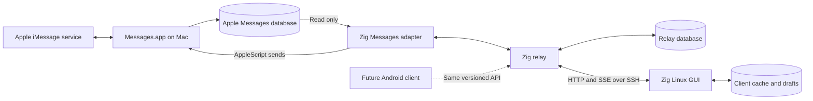

# iMessage relay design

Status: proposed design; implementation and macOS 27 compatibility have not yet
been validated.

Build a small, self-hosted system that uses an always-on Mac mini, signed into
Messages, to send and receive iMessages from a graphical Linux application.
Implement the relay and client in Zig. Use the sibling `../flamez` project as a
reference for Zig 0.16, Clay layout, raylib rendering, and platform build setup.

The first version serves one person and one Apple account. It supports listing
conversations, reading text history, receiving new messages, starting a direct
conversation, and replying to existing conversations. Existing group conversations
should support reading and text replies once their routing is validated on the
Mac. Creating or administering groups is outside the first version.

Attachments appear as descriptive placeholders initially. Attachment transfer,
reactions, editing, unsending, typing indicators, Apple read-receipt control,
contact-name lookup, and notifications are later features. Unknown message kinds
must remain visible as unsupported content rather than silently disappearing.

The Mac remains the endpoint that communicates with Apple's iMessage service.
The relay exposes our own API; Linux never receives Apple account credentials.
Initial connectivity uses an SSH tunnel to an HTTP service bound to the Mac's
loopback interface.



The two sections below identify the best development and validation environment.
They describe one repository and one system, not separate implementations of the
protocol. Shared behavior can be developed on Linux, but real Messages behavior
must be verified on the Mac.

## 1. Design and work that benefit from the Mac mini

### 1.1. Establish the macOS 27 integration contract

The first Mac milestone is a small integration probe, before building the full
service. Verify the following against the actual account, database, and OS build:

1. Messages.app can send and receive an iMessage normally.
2. A process with the intended executable identity can open the Messages database.
3. It can enumerate conversations, participants, and recent messages.
4. It can recover text from both ordinary text columns and attributed bodies.
5. A newly received message becomes observable without restarting the process.
6. An AppleScript send reaches a deliberately selected test recipient.
7. Direct sends, replies to existing direct chats, and existing-group replies
   select the correct conversation and service.
8. The same operations work from a LaunchAgent with the screen locked.

Record the macOS build and observed database schema with test results. Do not
assume compatibility merely because the program compiles or an automation call
returns successfully. Where a path is unsupported, report a specific capability
or integration error.

The intended baseline uses database reads and Messages.app automation without
private-framework injection or disabling System Integrity Protection. If an MVP
operation fails on macOS 27, investigate that operation before expanding the
platform privileges or claiming it is supported.

`imsg` is a useful reference and diagnostic comparison. Its current implementation
reads the local database and uses a bounded `osascript` child for ordinary sends.
It is not a required runtime dependency in this design:

- [imsg project](https://github.com/openclaw/imsg)
- [Sending and uncertain outcomes](https://github.com/openclaw/imsg/blob/main/docs/send.md)
- [Attributed-body decoding](https://github.com/openclaw/imsg/blob/main/docs/history.md)

### 1.2. Relay process and macOS integration boundary

Build a `relay` executable with a small macOS adapter behind an internal interface:

| Operation | Responsibility |
| --- | --- |
| Inspect capabilities | Check database access, schema support, and automation readiness |
| Read conversations/history | Return normalized records with stable source identities |
| Scan changes | Find new records, delayed joins, and supported updates |
| Dispatch text | Route one validated request through Messages.app |
| Inspect send outcome | Look for a corresponding outgoing record and observed status |

The adapter owns all Apple-specific identifiers, schema queries, timestamp
conversion, attributed-body decoding, and AppleScript details. The HTTP layer
must not issue SQL against Apple's schema or construct AppleScript.

Use SQLite through its C interface. Invoke a fixed AppleScript through
`/usr/bin/osascript`; pass message text and destinations as data arguments.
Never concatenate user text into a shell command or executable script source.
Launch the subprocess directly, bound its runtime and output, and reap it on
completion or timeout.

Keep the relay independent of GUI libraries. Use a serialized writer for relay
persistence and a serialized send worker for the account. A stalled send must
not stop ingestion, history reads, status requests, or connected clients.

### 1.3. Receiving and decoding messages

Open `~/Library/Messages/chat.db` read-only, including SQLite's normal handling of
the live write-ahead log. Never modify Apple's database, change its journal mode,
or treat an actively changing database as immutable.

Start with incremental polling at approximately one-second intervals. This is a
proposed default to measure on the Mac, not a latency guarantee. Filesystem
notifications can later trigger earlier scans, but periodic reconciliation remains
the recovery mechanism for dropped notifications and database-file replacement.

Normalize each readable message into:

- A relay message ID and conversation ID.
- Source identity retained privately by the adapter, normally an Apple GUID.
- Sender address, direction, service, and timestamps.
- Plain text, when decoding succeeds.
- A content classification and attachment metadata for placeholders.
- Observed delivery state, if available.
- A decoding status that distinguishes empty content from unsupported content.

Some records carry text in an encoded `attributedBody` rather than the plain
`text` column. Implement bounded decoding for formats verified with fixtures.
Preserve UTF-8, line breaks, and emoji. Malformed or unsupported bodies produce a
visible placeholder and a diagnostic classification; do not guess text by
extracting arbitrary printable bytes.

Treat reactions, membership changes, and other system records as distinct kinds
when identifiable. They must not be mistaken for ordinary incoming text.
Download and preview of attachment bytes remain outside the initial scope.

Use raw phone numbers and email addresses as display identities initially.
Names derived from Contacts are optional enrichment and require separate access.
Only explicitly identified iMessage conversations are sendable in this version;
there is no automatic SMS fallback.

### 1.4. Importing history and detecting changes

Apple's database is the source of observed Messages content. Our database is the
source of relay event ordering, client synchronization, and send-request history.
Apple row IDs can help scanning, but they are not public message identities or
client event cursors.

At first startup:

1. Capture a source high-water mark and enumerate conversations.
2. Import recent history first, then backfill older accessible history in bounded
   pages. Expose whether a conversation's history import is complete.
3. Concurrently scan source records beyond the startup high-water mark.
4. Merge records by stable source identity, so overlap produces updates rather
   than duplicates.

Maintain separate progress for historical import and live scanning. Records can
arrive with old message timestamps, so do not use timestamps alone to decide
whether a message is new.

Scanning must also account for existing rows that become complete later:

- Keep unresolved rows pending when conversation joins or bodies are not yet
  available; retry them independently of the insertion high-water mark.
- Revisit recent messages and outstanding outgoing messages for supported updates.
- Reconcile a conversation when its history is requested.
- Run a bounded rolling reconciliation over older indexed records.

The MVP promises new text and basic observed send-status updates. It does not
promise immediate synchronization of arbitrary historical edits, unsends, or
deletions. Historical reconciliation behavior should be measured and documented
without presenting those later features as implemented.

For each ingestion batch, commit normalized record changes, corresponding events,
and ingestion progress in one relay-database transaction. Advance progress only
after that transaction succeeds. On a crash, replaying a batch must be harmless.

Tag events caused by initial import or historical backfill accordingly. A client
must not notify about old messages merely because the relay discovered them today.

### 1.5. Relay persistence and identity

Store relay-owned state in a separate database under the user's Application
Support directory. A proposed logical schema is:

| Table | Purpose |
| --- | --- |
| `relay_meta` | Database version, server epoch, and event sequence |
| `conversations` | Normalized conversations and adapter routing references |
| `participants` | Conversation membership and raw addresses |
| `messages` | Normalized content, source identities, and observed statuses |
| `events` | Durable ordered changes for synchronization |
| `send_requests` | Idempotency records, dispatch state, and reconciliation |
| `ingestion_progress` | Import progress, live scan position, and pending source rows |

Use unique constraints on source message identity and client send-request identity.
Messages and conversations expose opaque relay IDs. Keep source row IDs, file
paths, and AppleScript routing strings private to the adapter.

Every durable public record has a monotonically increasing revision associated
with its latest relay event. Clients can therefore reject stale snapshots or
duplicate events.

Give the relay database a random epoch at creation. Ordinary restarts preserve
the epoch. Rebuilding the relay database or encountering an irreconcilable source
reset invalidates old cursors and requires a fresh synchronization. Never reuse
an old cursor against unrelated history or silently reuse IDs for new records.
Invalidate old routing references before accepting sends after such a reset.

Keep events initially for seven days, with a configurable count limit, proposed
at 100,000 events. Bound disk use and measure appropriate defaults. Pruning events
does not delete normalized history or send-request identities. A request for an
expired cursor receives an explicit resynchronization response.

Do not automatically prune idempotency records in the MVP. A delayed retry must
not become a new send because its original event has expired.

### 1.6. Sending, retries, and uncertain outcomes

A send targets either an existing conversation ID or a new direct recipient,
never both. New recipients use an explicit international phone number or an
iMessage email address. Avoid guessing a country code or resolving ambiguous
contact names.

The client generates a UUID request ID before submitting and persists it with
the outgoing draft and expected server epoch. The relay rejects a mismatched
epoch before accepting a send, then records the request and its normalized payload
before dispatching. Reusing the same ID and payload returns the existing request;
reusing the ID with a different payload returns a conflict.

Use these request states:

| State | Meaning |
| --- | --- |
| `queued` | The request is durably accepted and has not started dispatch |
| `dispatching` | The relay may have invoked the external send operation |
| `submitted` | A corresponding outgoing Messages record has been identified |
| `delivered` | The adapter has observed delivery confirmation |
| `failed` | A definite rejection or failure is known |
| `unknown` | The operation may have completed but cannot be confirmed safely |

Record `dispatching` before invoking the external operation. On restart, an
interrupted dispatch is reconciled or marked unknown, never automatically
submitted again. Persisted requests still in `queued` may resume only under the
same server epoch after validating their routing references. A source reset
holds old queued requests for review instead of redirecting them to new records.

An HTTP acceptance response means only that the relay owns the request. An
AppleScript success response alone must not be displayed as remote delivery.
If the automation path provides no authoritative outgoing message ID, correlate
against new database records using the actual route, direction, text, and a
bounded observation window. Serialize sends to reduce ambiguity, but recognize
that a user can also send identical text from another Apple device.

If correlation has multiple plausible candidates, keep the outcome unknown.
A timeout or process error after dispatch begins can also be ambiguous. Exactly
once delivery cannot be guaranteed across the relay database and Messages.app.
Idempotency prevents re-executing a known request; it does not remove that boundary.
An unknown request can later become submitted or delivered when new evidence
resolves it. A definite failure remains associated with the original request ID.

The client can query request status after a network failure using the original
request ID. An explicit user action to send again creates a new request ID and
explains any duplicate risk when the previous outcome is unknown.

Publish send-request updates and message updates through the event journal. Once
an outgoing message is identified, associate it with the request so the client
can merge its pending bubble with the observed message.

### 1.7. LaunchAgent, permissions, and recovery

Run under the same logged-in macOS user as Messages, using a user LaunchAgent.
Use a stable install path and packaging/signing identity where practical, and
validate how macOS attributes permissions to that identity and its subprocesses.
Prefer a small app wrapper if it materially improves reliable permission setup.

Setup needs:

- Messages signed into the intended account and able to send normally.
- Full Disk Access for the responsible process that reads the database.
- Automation permission to control Messages.
- A logged-in user session and system settings that keep the Mac available.

Test permission prompts and grants interactively before unattended startup.
The SSH process only forwards traffic; it should not need database access.
Do not assume that grants made to a development terminal transfer to the installed
LaunchAgent.

Launchd should restart a crashed relay. Add backoff for repeated startup failures.
After sleep, network interruption, Messages restart, or a temporary database lock,
the relay should reconnect to its dependencies and reconcile without losing its
journal. Revoked permissions should produce a degraded status rather than a
crash loop.

A locked screen and a logged-out account are different operating conditions.
Validate locked-screen operation. After reboot, user login and any disk-unlock
requirements can prevent the relay from starting; unattended restart is an
operational decision, not a guarantee supplied by a LaunchAgent.

Provide a local `relay doctor` command to check configuration, database access,
schema compatibility, and observed capability failures. It must not send a test
message automatically. Some automation checks require an interactive, explicitly
selected test operation.

References:

- [Apple: launch daemons and user agents](https://developer.apple.com/library/archive/documentation/MacOSX/Conceptual/BPSystemStartup/Chapters/CreatingLaunchdJobs.html)
- [imsg: permission attribution](https://github.com/openclaw/imsg/blob/main/docs/permissions.md)

### 1.8. Security and service operation

Bind the initial API to `127.0.0.1:8731`. Do not fall back to a public bind if
configuration fails. Use OpenSSH port forwarding from Linux, with host-key
verification and the user's normal SSH authentication.

Require a high-entropy bearer token on every API request, including status and
event subscriptions. Generate it during local setup, store it with owner-only
permissions, and support rotation. Never put it in URLs or logs.

The Mac can read message plaintext, and the client cache will also contain
plaintext. Apple's iMessage encryption terminates at the Mac; the relay-to-client
connection is a separate protected hop. The MVP relies on SSH in transit and
the operating systems' account and disk protections at rest.

Logs should contain operation IDs, error categories, durations, and counts.
Exclude message bodies, tokens, and raw participant addresses by default.
HTTP errors must not expose SQL, local paths, or complete subprocess output.

Serve history in bounded pages. Limit request sizes, decoder input sizes,
concurrent streams, and subprocess output. Disconnect slow event consumers rather
than allowing unbounded memory growth; their durable cursor permits recovery.
If the relay cannot persist a send request, reject it before dispatch.

Future direct connections require an explicit HTTPS/authentication deployment
design, including individual device credentials and revocation. A VPN can provide
connectivity, but does not replace the relay's authentication.

### 1.9. Mac acceptance checks

Use a deliberately selected test conversation for real sends. Verify:

- Direct text, multiline text, emoji, and a previously unseen direct recipient.
- Receiving and replying in an existing group without creating a different chat.
- Text decoding for actual macOS 27 records, including attributed bodies.
- Incoming and outgoing messages sent from other Apple devices on the account.
- Correct account/service routing, with unsupported services rejected.
- Operation while locked and under the installed LaunchAgent identity.
- Messages restart, relay restart, temporary database contention, and permission loss.
- Recovery of queued sends and non-repetition of interrupted dispatches.
- Source restoration/replacement detection and cursor invalidation.

Use fault injection or a fake adapter for destructive timing cases. Tests must
not manipulate the real Messages database to simulate corruption.

The Mac milestone is complete when a real received message appears through the
relay API, a reply reaches the intended recipient, and the installed process
recovers from restart with its message IDs and event history intact.

## 2. Design and work that should be done on Linux

### 2.1. Repository, build, and shared implementation

Keep the two executables in one Zig repository. Match the starting toolchain and
GUI dependency pins in `../flamez/build.zig.zon`, then pin this project's own
dependencies. Use Flamez as a reference, not as a runtime or build dependency.

A proposed layout is:

```text
build.zig
build.zig.zon
DESIGN.md
src/
  protocol/
    types.zig
    json.zig
    cursor.zig
  relay/
    main.zig
    Server.zig
    Journal.zig
    Sender.zig
    adapter/
      macos.zig
      fake.zig
  client/
    main.zig
    App.zig
    Connection.zig
    Store.zig
    Composer.zig
    text_engine.zig
    layout.zig
    theme.zig
  testing/
    fake_relay.zig
    fixtures/
packaging/
  macos/
  linux/
```

Only the client build imports Clay and raylib. Only the real relay adapter imports
macOS integration code. Shared protocol, journal, send-state behavior, and fake
adapters should build and test on Linux.

Use Zig 0.16's APIs as pinned by the actual toolchain; do not mix examples from
other Zig versions. Establish small transport and SQLite integration spikes before
committing to a networking dependency. Prefer existing HTTP parsing over a custom
HTTP implementation, while keeping its types out of the public protocol model.

Suggested build steps are `client`, `relay`, `fake-relay`, and `test`, with a
separate macOS compile check. Cross-compiling a relay helps catch build errors,
but real Mac testing remains necessary for permissions, frameworks, and Messages.

### 2.2. Versioned protocol

Use HTTP/JSON for commands and queries, and Server-Sent Events for updates. Each
SSE connection is initiated by a client. The Mac does not need to reach an inbound
port on the Linux machine.

The shared contract should define:

| Record | Essential fields |
| --- | --- |
| Conversation | ID, revision, participants, title, service, last activity, history-import status |
| Message | ID, revision, conversation ID, sender, direction, timestamp, content kind, text, observed status |
| Send request | Request ID, server epoch, target, text, state, associated message ID if known, structured error |
| Event | Cursor, sequence, type, full updated record, origin |
| Status | API version, server epoch, adapter readiness, capabilities, degraded reasons |

Represent public IDs as opaque strings. Encode 64-bit sequences as decimal
strings in JSON so future JavaScript clients do not lose precision. Normalize
timestamps to UTC strings, retain source precision internally, and use event
sequences rather than wall clocks for synchronization.

Expose these initial endpoints:

| Method and path | Behavior |
| --- | --- |
| `GET /v1/status` | Report readiness, epoch, and capabilities |
| `GET /v1/sync` | Obtain the current durable event cursor before bootstrapping |
| `GET /v1/conversations?before=...` | Page through conversations |
| `GET /v1/conversations/:id/messages?before=...` | Page through message history |
| `POST /v1/messages` | Durably accept or return an existing send request |
| `GET /v1/send-requests/:id` | Resolve a request after a disconnect |
| `GET /v1/events?after=...` | Replay events after a cursor, then stream live changes |

Conversation pagination uses an immutable key, not mutable last-activity order.
The GUI sorts its records by activity. History uses keyset pagination with a
documented timestamp/ID tie-breaker; live events cover new or backfilled records
that arrive while pages are being fetched.

A proposed send body is:

```json
{
  "request_id": "a-client-generated-uuid",
  "server_epoch": "the-epoch-observed-during-synchronization",
  "target": {
    "conversation_id": "an-opaque-conversation-id"
  },
  "text": "On my way."
}
```

For a new direct conversation, replace the target with
`{"recipient": {"address": "+14155550123", "service": "imessage"}}`.
Validate that exactly one target form is present.

Initial event types are `conversation.upsert`, `message.upsert`, and
`send_request.updated`. Prefer complete normalized records over patches in v1,
so replay and deduplication remain simple. Event origins distinguish live
observation, historical import, and reconciliation.

Use SSE's `id` field for the opaque cursor and its `event` field for the event
type. Send comment heartbeats, initially every 15 seconds. Support reconnection
using an explicit cursor and optionally `Last-Event-ID`; reject contradictory
values instead of guessing.

Return structured errors with a stable code, a safe human-readable message, and
whether a send is definitely unstarted or has an uncertain outcome. Relevant
codes include `invalid_request`, `unauthorized`, `unsupported_target`,
`permission_required`, `adapter_unavailable`, `request_conflict`, and
`resync_required`. Epoch mismatches reject sends with `resync_required` before
any dispatch.

Use HTTP 202 for a newly accepted asynchronous send; replaying an existing request
returns its current representation without dispatching. Use 400 for invalid
input, 401 for authentication failure, 409 for conflicts or epoch mismatch,
410 for an expired event cursor, 413 for oversized requests, and 503 when an
unavailable adapter prevents acceptance. Errors after acceptance belong to the
durable send request; a later HTTP failure does not revoke an accepted send.

Proposed initial limits:

- Request body: 64 KiB; outgoing UTF-8 text: 16 KiB.
- History pages: 50 records by default, at most 200.
- Bounded event frames, with oversized content represented by metadata/placeholders.
- Explicit errors for oversized sends; no silent truncation.

These are relay limits, not claims about Apple's limits. Final constants belong
in the shared contract and should be adjusted using fixtures and Mac results.
Accept unknown optional JSON fields. Additive capabilities can extend v1; a
required semantic change needs protocol negotiation or a new major version.

### 2.3. Synchronization without missed messages

Use durable events with at-least-once replay. Applying the same event twice must
be harmless. Keep transport cursors separate from message history pagination and
from local read/unread state.

For initial synchronization:

1. Obtain cursor H and the server epoch before fetching any snapshots.
2. Fetch conversation pages and recent history for visible conversations.
3. Replay events after H and continue streaming.
4. Merge every snapshot/event by record ID and revision, ignoring older revisions.

Fetching snapshots and replaying events intentionally overlap. Every public
mutation must have a durable event committed atomically with its new revision.
That invariant closes the gap between a history request and stream attachment.
The server must likewise attach replay to live delivery without a sequence gap.

If H expires during bootstrap, restart synchronization explicitly. Do not silently
start at the latest event. Historical import events populate history without
generating fresh-message notifications.

On an ordinary reconnect, resume from the last committed client cursor. Apply
record changes and advance that cursor in one client-database transaction.
If a connection drops before commit, replay supplies the event again.

If the epoch changes or a cursor expires, refresh server-backed records while
preserving local drafts. Clearly mark retained content as stale until reconciled.
An unresolved old send request must not be automatically submitted to a rebuilt
server that no longer has its idempotency record.

### 2.4. Graphical application

Build a desktop window using Clay and raylib, following the reusable parts of
Flamez: window setup, scaling, layout, theme organization, and render-loop
structure. Start with its Wayland path; document the supported display backend
and add X11 support separately if needed.

The first interface has:

- A conversation sidebar with participant/title, preview, timestamp, and a local
  unread marker.
- A message pane with incoming/outgoing alignment, wrapping, timestamps, and
  pending/failed/unknown send states.
- A multiline composer with selection, copy/paste, undo/redo, and a send action.
- A new-conversation action accepting a phone number or email address.
- A connection indicator and actionable permission/integration errors.
- Explicit loading, empty, stale-cache, and unsupported-content states.

Enter sends and Shift+Enter inserts a newline. Do not intercept Enter to send
while an input method is composing text. Preserve drafts per conversation and
preserve failed submissions. A pending bubble appears immediately after the local
request is persisted, then merges with the server's send request and message.

Preserve scroll position when loading older history. Automatically follow new
messages only when already near the bottom; otherwise show a new-message marker.
Render only visible message rows, with cached measurements invalidated by text,
font, or width changes.

Reading in this application updates local read state. It does not mark the Apple
conversation read or send Apple read receipts. Maintain a local observation order
for incoming live messages; historical imports must not inflate unread counts.
Changing the server epoch requires reconciliation of read markers.

On startup, show cached history immediately and label connection status.
Offline users can read cached content and edit drafts. The MVP does not accept
new sends while knowingly offline or maintain a hidden offline send queue.
A request already accepted by the relay can still complete after disconnection.

### 2.5. Text is a first-class subsystem

Flamez demonstrates layout and rendering, but its label-oriented text helpers are
not a complete chat editor. Build a small text-engine boundary so font handling
and editing can improve without rewriting conversation logic.

The early text spike must exercise:

- Multiline editing, wrapping, selection, clipboard round trips, and undo.
- UTF-8 storage with cursor movement and deletion at grapheme boundaries.
- Accented text, combining marks, common emoji, and joined emoji sequences.
- Font fallback when the primary font lacks a glyph.
- HiDPI rendering and caret placement that agrees with measured text.
- Long unbroken strings and messages near the configured size limit.

Do not confuse code-point boundaries with user-visible character boundaries.
Use a maintained Unicode implementation or system text facilities for segmentation
and shaping rather than growing a hand-written special-case list.

Clay owns layout; the text engine owns shaping, measurement, glyph rendering, and
editing semantics. Raylib can present the resulting graphics. If its basic text
path cannot meet the spike's requirements, add a text-library/C interop layer
behind this boundary. Keep this choice explicit until tested.

The first text milestone should support ordinary keyboard input, paste, and common
Unicode/emoji messages correctly. Full bidirectional editing, input-method
integration, accessibility, and complete font/script coverage need explicit
follow-up milestones if the chosen stack does not provide them. Unsupported glyphs
must remain copyable with original text intact. Do not advertise complete text
support based only on ASCII examples.

### 2.6. Client ownership, I/O, and persistence

Keep window/input processing, Clay layout, and raylib rendering on the main thread.
A background connection worker owns HTTP requests, the SSE connection, retry
timing, and the client store. It must service command requests concurrently with
the long-lived stream, using the chosen I/O implementation's concurrency support.

The GUI thread owns the presentation model. Pass owned commands and committed
updates through bounded queues; the worker must never mutate GUI objects directly.
Serialize store writes, commit event/cursor changes before publishing UI updates,
and persist a send request before starting its HTTP submission. Draft-save
commands use the same store owner. Network latency, SQLite waits, and reconnect
backoff must not block typing or presentation.

On queue saturation, apply backpressure or reconnect from the last committed
cursor rather than dropping changes. If UI update publication is interrupted
after a commit, rebuild the presentation from committed cache records. Orderly
shutdown flushes pending draft-save commands; periodic draft saves limit loss
after a crash.

Use a local SQLite cache for:

- Conversations and downloaded history.
- The committed server epoch and event cursor.
- Local read markers and per-conversation drafts.
- Outgoing request IDs, payloads, and last known outcomes.

Store non-secret preferences in the normal user configuration directory. Store
message cache and drafts in the user's application data directory. Keep tokens in
a desktop secret store where available, with an owner-readable file fallback
whose behavior is documented. Do not put tokens in process arguments.

Render in response to changes and input, with a modest idle wakeup policy.
A messaging window should not continuously redraw at a game-like frame rate when
nothing changes. Desktop integration should use its own application ID and
`.desktop` entry, following Flamez's build patterns without retaining its identity.

### 2.7. Initial connection experience

For the first development version, users establish the SSH tunnel themselves:

```sh
ssh -N -T -o ExitOnForwardFailure=yes \
  -L 127.0.0.1:8731:127.0.0.1:8731 user@mac-mini
```

The GUI connects to `http://127.0.0.1:8731` and receives the relay token through
local configuration. This keeps SSH host verification, keys, and interactive
authentication in the user's existing SSH tooling. A different local port can
be configured if needed.

The client distinguishes:

- Tunnel/API unreachable.
- Authentication rejected.
- Relay reachable but Messages integration unavailable.
- History synchronizing.
- Connected and current.

Retry transient connection failures with exponential backoff and jitter, initially
from one to 30 seconds. Authentication and configuration errors need user action
instead of continuous retries. A network error after a send submission triggers
status lookup with its original ID, not a fresh request.

Managing an SSH child from the GUI can be added later, with explicit host trust
and credential handling. Android will likely use a private network or HTTPS
deployment rather than this desktop-oriented tunnel setup.

### 2.8. Mock relay and Linux verification

Create a fake adapter that feeds the real relay core and journal. Use it for
integration tests so the fake service cannot quietly implement a different
protocol. Add a scripted transport fault layer for malformed frames and disconnects.
GUI development can run entirely against these deterministic fixtures.

Fixtures should cover:

- Direct and existing-group conversations, long histories, and empty history.
- Multiline text, combining characters, emoji, and unsupported content.
- Incoming messages during pagination and during initial synchronization.
- Historical backfill that should not generate unread markers or notifications.
- Duplicate event delivery and stale snapshots.
- Reconnect, expired cursors, and a changed server epoch.
- Delayed sends, definitive rejection, unknown outcomes, and outgoing echo merging.
- Truncated SSE frames, heartbeats, slow consumers, and interrupted HTTP responses.

Prioritize tests of observable behavior:

1. A message arriving between snapshot and stream attachment is eventually visible.
2. A replayed event does not produce a duplicate message.
3. Repeating a send ID never dispatches it twice; a changed payload is rejected.
4. A crash after dispatch starts leaves an uncertain request without automatic resend.
5. Event application and cursor persistence recover correctly across a client crash.
6. Importing old history does not mark every conversation unread.
7. Drafts and Unicode text survive restart and clipboard/editing operations.

Keep protocol, journal, and request-lifecycle tests independent of a GPU and real
Apple account. Use GUI smoke checks for layout, scrolling, input, and scaling.
Use synthetic or sanitized fixtures; keep real message history out of the repository.

Run Zig formatting and the project's test targets for implementation changes.
Cross-compile checks supplement, but do not replace, the Mac acceptance checks.

### 2.9. Extension points

**Linux notifications.** Consume committed incoming live-message events after
deduplication. Suppress historical imports, outgoing messages, and messages already
being viewed. Desktop notifications require a running process; background receipt
after closing the window needs an explicit background mode or separate user service.

**Android.** Reuse the wire protocol and synchronization semantics. Sharing Zig
model code is optional; the Android UI and lifecycle integration can be native.
Reliable background alerts need a push path in addition to the foreground event
stream. A push can signal that changes are available, with content fetched through
the authenticated API. Design payload privacy, device registration, and credentials
when implementing that feature.

**Attachments.** Add authenticated attachment endpoints and lazy downloads.
Retain attachment IDs and metadata in the initial model, but never expose arbitrary
Mac filesystem paths as downloadable resources.

**Richer iMessage features.** Add capabilities per operation and adapter version.
Unsupported operations stay disabled. Typing indicators, Apple read receipts,
group administration, and message mutations may require a different integration
strategy; they must not be implied by basic text support.

**Multiple clients.** Each client has an independent event cursor, local drafts,
and local read markers. The durable journal already supports multiple readers.
Per-device authentication and optional shared read state are later additions.

### 2.10. Delivery sequence and completion criteria

| Stage | Preferred environment | Concrete result |
| --- | --- | --- |
| 1A: Messages probe | Mac mini | Verified reads, decoding, direct send, and group reply behavior on macOS 27 |
| 1B: GUI/text spike | Linux | Conversation mockup and usable multiline Unicode composer |
| 2: Shared core | Linux | Versioned API, journal, send lifecycle, fake adapter, and recovery tests |
| 3: Real relay | Mac mini | Adapter connected to core; installed LaunchAgent and permission setup validated |
| 4: Integrated client | Linux with Mac relay | Real history, live messages, sending, reconnect, drafts, and clear failures |
| 5: Operational checks | Both | Locked-screen operation, restarts, interrupted sends, and cache recovery verified |

Stages 1A and 1B can proceed independently. The protocol can be exercised on Linux
while Mac-specific behavior is investigated. Keep schema and automation findings
inside the adapter rather than changing the public API for every macOS detail.

The first version is complete when:

- A Linux user can browse available iMessage conversations and read text history.
- New messages appear while connected, and missed messages recover after reconnect.
- Direct sends and supported existing-conversation replies reach the intended target.
- Pending, failed, and uncertain sends are represented honestly and recoverably.
- Closing the client preserves drafts and synchronization progress; after a crash,
  committed drafts and progress recover without duplicate sends.
- The Mac relay runs under its installed user session with the screen locked.
- No Apple account credentials are needed on Linux.

Before implementation expands, resolve three measured questions: the exact
macOS 27 database/automation behavior, the text backend needed for the composer,
and stable macOS permission attribution for the installed relay. These are
validation tasks within this design, not reasons to postpone the shared protocol
or Linux client work.
