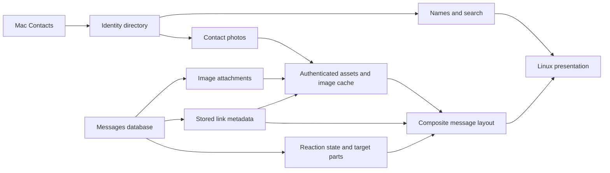

# Contacts, images, link previews, reactions, and contact photos

Status: implemented for the shared protocol and Mac relay; Linux
client changes are outside the current implementation task. This extends
[DESIGN.md](../DESIGN.md). The original repository observations below describe
the starting point on 2026-09-23. See the
[Mac enrichment acceptance record](mac-enrichment-acceptance.md) for current
implementation and verification evidence, including the native reaction checks
that remain deferred. The platform checks below describe the intended
acceptance coverage; the evidence record distinguishes completed and deferred cases.

Build two shared facilities: an address-to-contact presentation directory and an
authenticated image pipeline. Use both from the message UI. Normalize existing
link metadata and reactions in the Mac adapter, where Apple's formats belong.

| Requested feature | Result | Dependencies |
| --- | --- | --- |
| Contacts | Names for known phone/email handles in conversations, messages, search, and notifications | Contacts permission, matching, directory sync |
| Attached images | Inline images, including messages with captions or several images; click for a larger view | Asset delivery/cache, composite message layout |
| Existing URL unfurls | Cards using metadata and locally available imagery already stored by Messages | Payload decoder, composite layout; asset pipeline for imagery |
| Reactions | Small emoji/count chips on the targeted message or message part, with who reacted | Target/part decoding, durable reaction state, composite layout |
| Profile pictures | Contacts photos in participant avatars and direct-conversation avatars | Contacts directory plus asset pipeline |

This is a reading/presentation extension. Sending attachments or reactions,
editing Contacts, discovering iMessage-shared profile photos outside Contacts,
generating new web previews, playing video/audio, and animated stickers are
separate features. Existing text sends continue to address the original handle
or conversation ID; a contact match never changes routing or merges chats.

## What is already present

| Current source | Evidence and consequence |
| --- | --- |
| [Protocol types](../src/protocol/types.zig) | Participants and sender are address strings. `Attachment` carries ID, name, MIME type, and byte count. `Message.kind` already includes `reaction`, but no target, emoji, or aggregate state. Keep these compatibility fields. |
| [Messages adapter](../src/relay/adapter/MessagesDb.zig) | Reads at most 32 attachment metadata records, hashes attachment GUIDs, and does not read file paths. Classifies types 2000–3999 broadly as reactions. Nonempty balloon providers become unsupported content. Neither rule is a complete decoder. |
| [Recorded Mac schema](macos-27-schema.json) | The recorded macOS 27.0 / build 26A428 schema contains `filename`, `uti`, `transfer_state`, `payload_data`, `associated_message_guid`, range fields, and `associated_message_emoji`. Presence establishes candidate inputs, not their semantics. |
| [Core](../src/relay/Core.zig), [Journal](../src/relay/Journal.zig) | Durable revisions/events, live/backfill/recent/rolling scans, pending source rows, and requested-chat reconciliation exist. A missing source row currently only leaves the pending set; it does not remove a published reaction. |
| Source reset detection in Core | A regressed maximum row ID or missing live-cursor GUID anchor resets the epoch. Deletion of the latest reaction can satisfy those conditions; reaction support must distinguish that case from a replaced database. |
| [Server](../src/relay/Server.zig), [Store](../src/client/Store.zig) | Status advertises `attachments=false`; there is no binary asset route. Client event dispatch rejects unknown event types. Most record parsing ignores additional fields, but `ConversationPreview` parsing is strict. |
| [Display](../src/client/display.zig), [history](../src/client/MessageHistory.zig), [GUI](../src/client_main.zig) | Presentation is one text string per message; avatars are initials and names are handles. Attachment presentation uses the first attachment and can lose a caption. Prepared presentation keys are based on text, so richer content needs broader invalidation. |
| [Network bridge](../src/client/bridge.c), [worker](../src/client/Worker.zig) | One ordinary request slot and one SSE slot exist. Adding image requests to the ordinary slot would compete with sends/history/recovery. |
| [Mac installer](../packaging/macos/install.py) | The signed LaunchAgent app has an Automation usage description, but no Contacts usage description or Contacts integration. |

## Shared protocol and persistence

Keep the v1 address, text, attachment, and message-kind fields readable by existing
clients. Add optional enrichment fields with defaults. Do not add enum values to
fields old clients parse as closed enums. Keep the current `ConversationPreview`
shape until its parser is made tolerant; richer sidebar text can fit its existing
`kind` and `text` fields.

Use these logical records; exact Zig layouts follow the fixture milestone:

| Record | Proposed contract |
| --- | --- |
| `Identity` | Opaque `id`, decimal-string `revision`, original `service` and `address`, nullable `display_name`, nullable avatar asset, and `match_state` (`pending`, `matched`, `unmatched`, `ambiguous`, `unavailable`). Unique by service + original address within a relay epoch. OS contact identifiers stay private. |
| `AssetRef` | Opaque ID, immutable representation version, variant, actual output MIME type and byte count, pixel width/height when known, availability, safe reason code. No file paths or arbitrary fetch URLs. |
| Message enrichment | Ordered `parts` referencing text/attachments/link previews; per-message enrichment status; active `reactions`; optional normalized `reaction_event` on source reaction rows. Keep `text` and `attachments` for fallback and copying. |
| `LinkPreview` | Stable ID/part reference, original URL, optional metadata URL, title, summary, site name, optional local image/icon assets, and decode state. |
| Active `Reaction` | Stable ID, target part ID or explicit unresolved-part state, actor address/service or `self`, reaction key, and emoji when known. Contact names never identify actors. |
| `reaction_event` | Normalized target message ID when resolved, target part reference, actor, operation/current source state, reaction value, and resolution status. Private source GUIDs and ordering evidence live in the relay. |

An absent enrichment field means the producer does not supply it. A present empty
array with a complete state means no items. Distinguish pending, unavailable,
unsupported, and malformed data. Clients must replace an older complete aggregate
with a newer empty aggregate; otherwise removed reactions and images survive.

Message parts need stable IDs independent of layout and display order. Recover
attachment placement and source part indices from verified attributed-body
structure, including file-transfer references. Apple's part indices are not
attachment SQL row order. Until placement is known, show the full text followed by
the attachment list, mark part mapping unresolved, and place any known reaction
at message level with that limitation visible in its detail. Never discard text
because the message also contains an image or a URL.

Add relay tables for identities, private contact mappings, assets/source mappings,
reaction source observations, target dependencies, and retry/reconciliation work.
Use the existing journal writer to commit normalized changes, progress, revisions,
and events together. Keep expensive Contacts queries and image work outside the
Core mutex. Completion jobs carry source identity/version so a stale job cannot
publish into a newer source version or epoch.

The client stores identities separately from messages, plus asset metadata and
disk-cache references. A contact rename updates presentation through identity
dependencies; it does not rewrite every historical message. Reaction and preview
changes publish a full enriched `message.upsert` for the affected target with
origin `reconciliation`; the original timestamp and delivery state stay intact.
Source-message refreshes must merge the independently computed enrichment rather
than overwrite it with empty defaults.

### Events, bootstrap, and mixed versions

Add `identity.upsert` as an **opt-in stream extension**:

- Status advertises `identity_directory_v1`, `image_assets_v1`,
  `image_attachments_v1`, `stored_link_previews_v1`, `reactions_v1`, and
  `contact_avatars_v1`, with separate readiness/reason fields. Preserve the legacy
  `attachments` flag and define it as image attachment retrieval when enabled.
  A codec or Contacts failure degrades its own feature, not text messaging.
  Versioned capabilities describe implemented protocol support; permission loss
  changes readiness, not whether clients can sync clearing identity records.
  Probe optional source columns/queries independently; adding them to the required
  baseline query would otherwise make an unsupported enrichment disable history.
- New clients request `/v1/events?...&extensions=identity-v1`. The server validates
  and echoes the accepted extension set in response headers. Unknown requested
  extensions fail explicitly; old relays must never be assumed to accept them.
  Extend the C network bridge to expose the selected response header to the
  worker. New clients use legacy behavior when status lacks these capabilities.
- Legacy streams emit only their three existing event types. Skip identity events
  server-side while advancing the server's scan position; retain global sequence
  numbers. Clients already compare monotonic sequences without requiring every
  intermediate number. A legacy client's last delivered cursor can age out during
  an identity-only interval; the existing explicit resync behavior handles this.
- New message fields are additive in both history and events. Keep source reaction
  rows as legacy placeholders. Rich clients suppress a successfully resolved
  reaction row because its state is shown on the target. Unresolved or unsupported
  reaction rows remain visible with a descriptive fallback.
- Capture cursor H before fetching conversation and identity pages, then replay
  after H with the accepted extension. Identity pages use immutable-ID keysets;
  tombstone-like unavailable/unmatched records clear removed names/photos. Merge
  by revision and commit identities and cursor in one client transaction.
- Persist the accepted extension set. First enabling identities requires an
  identity bootstrap even if the relay epoch is unchanged; never resume a legacy
  cursor as if it implied a complete directory. Do not mark bootstrap complete
  until all identity pages are merged. Expired H restarts bootstrap.
- Enrichment changes cannot create unread messages or duplicate notifications.
  Update current `Store.eventNotification` eligibility to exclude recognized
  reaction rows, including changes/removals. Contacts, image availability, and
  previews update quietly. New incoming photo messages still notify once.

Use normal schema migrations without resetting the relay epoch or send-request
records. Schedule a versioned, resumable enrichment backfill; prioritize visible
and recent chats. On source/relay epoch reset, invalidate identities, reaction
dependencies, asset references, and unfinished jobs while preserving drafts and
outbox recovery. Cache keys include the configured relay identity and server epoch.

### Read endpoints

| Proposed endpoint | Behavior |
| --- | --- |
| `GET /v1/identities?before=...&limit=...` | Page only identities for addresses already observed in chats/messages, including historical senders and reaction actors. No complete address-book export. |
| `GET /v1/assets/:id/:version/:variant` | Deliver an approved immutable image representation under existing mTLS/device checks. |
| `GET /v1/messages/:id/enrichment?section=...&revision=...&after=...` | Retrieve overflow attachment, preview, or reaction metadata when an inline aggregate exceeds its budget. Stable item order and tokens bound to section/message revision; changed revision returns a restart-required conflict. |

Inline lists include a total and complete/overflow indicator. Start with up to 32
attachments, 4 preview cards, and 128 active reactions, within a combined 32 KiB
enrichment metadata budget per message. Exceeding a budget exposes “Show more,”
not silent truncation. Endpoint pages also have a byte budget; history page
assembly respects the actual client response/SSE limits as well as record count.
No binary data or base64 belongs in history, SSE, or sidebar previews.

## Contacts and profile pictures

Use a small Objective-C/C boundary around `CNContactStore` on the Mac, linked only
into the native relay. Fetch unified contacts, the name formatter's required keys,
phone numbers, email addresses, and image availability. Names should use
`CNContactFormatter`, then organization name if there is no personal name.
Run Contacts reads on a dedicated worker and invalidate cached results on
`CNContactStoreDidChange`; Apple documents both limited key fetching and the need
to refetch cached contacts after changes. [Apple Contacts framework](https://developer.apple.com/documentation/contacts)

The installed bundle needs `NSContactsUsageDescription`, explaining that Zimbr
uses names/photos for conversations on enrolled clients. Add an explicit local
setup action, proposed `relay doctor --request-contacts`, to request permission
interactively through that same installed identity. Normal LaunchAgent startup
checks authorization without prompting. Full Disk Access and Automation are
separate permissions. Treat denial/restriction as optional enrichment unavailable;
validate any limited-access status against the actual macOS SDK/runtime rather
than assuming iOS behavior. [Apple authorization documentation](https://developer.apple.com/documentation/contacts/accessing-the-contact-store)

Matching policy:

1. Retain the source address exactly for display fallback and routing. Index a
   separate lookup key on the Mac, with the normalization algorithm versioned.
2. For email, trim surrounding whitespace and normalize the domain. Prefer an
   exact local-part match; accept a case-insensitive candidate only when it gives
   one unambiguous unified contact. Do not strip plus tags, dots, or merge domains.
3. For phone numbers, compare parsed international numbers after formatting is
   removed. Support national-format Contacts entries through a maintained phone
   number parser with an explicitly configured `contacts_phone_region`; suggest
   the Mac's region during setup, but do not silently infer it from the Linux
   locale. Select/pin the parser and its Mac build integration in milestone 1.
   Without a region, international/exact matches still work. Never suffix-match
   the last seven or ten digits. Extensions and short codes need exact handling,
   not an invented international number.
4. Several handles may resolve to one unified contact. Multiple candidate contacts
   for one handle produce `ambiguous` with the raw address and initials. Never
   choose whichever contact happens to be returned first. Contact identity does
   not collapse two reaction actors or separate chat routes.

Only directory entries for observed handles cross to Linux. The Mac may build a
local in-memory index of accessible contacts for efficient matching. Coalesce
change notifications; refresh at startup, on change, on newly observed handles,
and with a periodic reconciliation (initial target: every 15 minutes). A failed
scan is not evidence of contact deletion. Successful removal or permission loss
clears the relevant live name/avatar records with new revisions; temporary query
failure marks cached matches stale. Expose freshness and permission state in
Details without logging names, addresses, or contact identifiers.

The shared client name resolver serves sidebar, header, message sender, reaction
detail, search, and summaries of newly received notifications. Preserve an explicit chat
title. Otherwise use the other participant's name for a direct chat and a bounded
list of participant names for an unnamed group. Keep the raw address available in
participant detail; search matches both name and address. Outgoing messages remain
“You”; do not infer the local user from the first participant or a matching surname.
Do not resend existing notifications merely because a name becomes available.

Fetch `thumbnailImageData` lazily for matched, referenced contacts. It preserves
Contacts' thumbnail/cropping choice; it may be absent, and Apple recommends
fetching it only when needed. [Apple contact thumbnail documentation](https://developer.apple.com/documentation/contacts/cncontact/thumbnailimagedata?language=objc)

Normalize the photo into an avatar asset. Reuse it across handles mapped to the
same contact while keeping their identities separate. A photo change publishes
a new asset version and identity revision. Removal immediately restores initials
once that revision is applied. Use photos in the existing 34-pixel message-avatar
slot and direct-chat avatars; add a compact avatar slot to sidebar rows. Preserve
stable sender colors for labels and fallback initials. Groups use a group glyph
initially, not an arbitrary member's photo. “You” retains initials unless the Mac's
own contact can be explicitly resolved; this is not required to show peer photos.

An available contact image gets a pending asset descriptor; requesting its avatar
variant schedules the thumbnail read/conversion. A Contacts change invalidates
thumbnail jobs and cached source versions even when the name and
`imageDataAvailable` boolean are unchanged. Refresh avatars already requested by
clients; defer unused thumbnails. This avoids both eager address-book photo
decoding and permanently stale pictures after a photo-only edit.

Cached names/photos remain readable offline, like cached messages. Denial observed
on reconnect invalidates contact presentation and evicts avatar references; it
does not delete messages or drafts. Replay may contain older contact events under
normal journal retention, so gate their presentation by the current Contacts
availability state until reconciliation finishes. Offline clients cannot learn a
permission change until reconnecting.

## One image pipeline for all three image sources

The pipeline handles image attachments, local link-preview artwork, and contact
photos. Source discovery remains distinct; asset serving and client rendering are
shared. Keep original attachment IDs stable and attach asset references to them;
do not treat today's hash ID as a filesystem path or authorization mechanism.

On the Mac:

- Resolve a database attachment privately through its GUID/row join. Read
  `filename`, UTI/MIME, transfer state, and size when those columns are supported.
  A missing file is `not_local` or `pending`, not proof of an empty attachment.
  Zimbr does not initiate an iCloud download; suggest opening Messages on the Mac
  when the source is not local.
- Permit files only under the user's Messages attachment root. Expand only the
  expected home-relative form, open through protected directory descriptors,
  reject traversal/symlink escapes and non-regular files, and validate the opened
  file's identity. Do not accept a path supplied by an API client. If actual Mac
  fixtures use another root, document and narrowly allow it before supporting it.
- Identify supported images from inspected bytes as well as metadata. Use
  ImageIO to create oriented, bounded JPEG/PNG derivatives, with transparency when
  needed and without location metadata. This puts HEIC/HEIF conversion on the Mac
  and keeps Linux decoding simple. ImageIO supplies thumbnail generation;
  actual format coverage remains a Mac acceptance check.
  [Apple ImageIO thumbnail API](https://developer.apple.com/documentation/imageio/cgimagesourcecreatethumbnailatindex(_:_:_:))
- Use a bounded helper process for media decoding, with a timeout and resource
  budget, so a corrupt image cannot stall the journal/send workers. Start with
  one conversion at a time. Check dimensions before decode; source size, pixel
  count, derivative size, queue depth, and disk use all need explicit limits.
- Key generated bytes by source fingerprint, variant, and transform version.
  Register pending metadata at source discovery so a client can request work.
  Use an opaque immutable source-generation version before bytes are available;
  the ETag identifies the finished representation. Verify source identity around
  conversion; publish ready metadata and its owning record only after an atomic
  file install. Discard stale jobs, sweep abandoned temporary files, and
  garbage-collect unreferenced derivatives. Regeneration must reproduce the same
  bytes/ETag for that version or allocate a new version and update the owner.
- Retry pending files with bounded backoff and recheck on visible-chat requests
  and rolling reconciliation. File arrival can happen without a new message row;
  maintain attachment retry work independently of the new-message scan.

Proposed initial budgets: 100 MiB source file, 100 megapixels, 15 seconds per
conversion, 512 MiB helper memory, 128 queued jobs, 2 GiB relay derivative cache.
Variants: avatar up to 128×128; inline image up to 1024 pixels on the long edge;
viewer up to 2560 pixels. Cap an encoded derivative at 8 MiB and decoded output
at 32 MiB. Reject/mark oversized inputs visibly; tune using the fixture corpus
before calling support complete. An animated image gets its first frame and a
“Still preview” indication in this scope.

The asset route checks client enrollment/revocation and epoch ownership just as
ordinary API traffic does. Look up an approved record under the journal lock,
then stream bytes after releasing it. Use a quoted immutable ETag, actual
`Content-Type`/`Content-Length`, `Cache-Control: private`, and `nosniff`; honor
`If-None-Match`. No redirects or externally hosted image requests. Distinguish
unknown ID (404), retired version (410), pending/not-local/unavailable
representation (structured 409), and temporary worker saturation (503 with
bounded retry). Authentication failures retain their existing behavior. Regenerate
an evicted derivative if its source still exists; a pending regeneration is
retryable. Byte-range transfer is unnecessary for these bounded derivatives.
Bound simultaneous asset responses and slow-reader write time; reserve server
connection capacity for command/history requests and SSE. A pending asset request
enqueues one deduplicated conversion and returns a retry hint without waiting on
the decoder. Only retryable reasons get automatic backoff. A retired version
triggers owner-metadata reconciliation rather than endless retries of the old URL.

On Linux, add a media request lane with at most two concurrent transfers,
separate from SSE and send/recovery traffic. Apply the same TLS/origin rules and
credential reload/cancellation behavior. Stream to private temporary files with
byte limits; verify successful completion before atomic cache install. Do not
route binary replies through JSON response buffers. Cancel obsolete requests on
chat switch/epoch reset, and ignore late results from prior generations.

Start with a 512 MiB disk LRU and a separate 128 MiB budget for decoded pixels and
GPU textures combined. Deduplicate in-flight requests by asset/version/variant;
load visible images and a small near-viewport margin. Decode bounded JPEG/PNG on a
worker; upload/unload raylib textures on the GUI thread. Reserve space from the
asset dimensions, use a fixed placeholder when dimensions are unknown, and keep
the top visible message/part and offset anchored when geometry changes. HiDPI
selects an appropriate variant; it must not multiply caches without limit.

A transient failure offers retry, offline uses cached bytes, and unsupported or
oversized content keeps its filename/type placeholder. Downloads should never
disable typing, delay a send recovery, or turn a failed image into a failed event
batch. Cache files use owner-only access, contain private media, and are excluded
from diagnostics. Contact permission revocation evicts its avatar references;
ordinary image LRU eviction never affects canonical message records.

Linux tests use the real asset service with synthetic image sources and a fake
converter. Native builds link Contacts/Foundation and ImageIO through the Mac
bridges; Linux does not acquire those framework dependencies. The image helper
should receive an already-approved file descriptor or bounded photo/payload bytes,
not arbitrary paths or the relay's TLS credentials. Launch it directly and sign
it inside the installed app alongside the relay.

## Attached-image UI

Replace the single presentation string with prepared text/image/card blocks.
Keep existing text measurement, clipping, selection, and full-text copy behavior.
Inline images fit the message-column width, preserve aspect ratio, and reserve
space before completion. Show multiple images in source order as a bounded grid
or vertical sequence; each is independently focusable/clickable. Captions remain
visible even when one image fails. Non-image attachments retain descriptive rows.

Clicking an image opens an in-app larger view using the viewer variant, with
Escape/close, keyboard next/previous for that message, and loading/error states.
Original-file download/export and image sending can follow separately. Sidebar
and notification previews prefer a caption, otherwise “Photo” / “3 photos” or
the existing unsupported-attachment description. Preview completion does not
change message chronology or notification eligibility.

## Existing URL previews

The source is stored Messages payloads, not a fetch of the URL. The reference
imessage-exporter implementation identifies `com.apple.messages.URLBalloonProvider`
and extracts fields such as title, summary, original/final URL, site name, images,
and icons. These are reverse-engineered formats, not a public Apple database API;
use them as fixture leads and verify the target Mac.
[Reference URL parser](https://github.com/ReagentX/imessage-exporter/blob/develop/imessage-database/src/message_types/url.rs)

Add a bounded decoder beside the existing attributed-text decoder for confirmed
binary/XML property-list and keyed-archive layouts in `payload_data`. Traverse
only known keys and primitive containers, with limits on input bytes, object
count, recursion, UID references, and output strings; detect cycles and invalid
indices. Do not instantiate arbitrary archived classes. Start at the existing
1 MiB decode budget and a depth of 32; unsupported larger payloads retain a useful
fallback. The reference parser demonstrates keyed-archive UID resolution and
`richLinkMetadata`; it does not establish that every OS version uses that shape.
[Reference payload parser](https://raw.githubusercontent.com/ReagentX/imessage-exporter/develop/imessage-database/src/util/plist.rs)

Normalize standard URL cards first. If a payload has a safe URL and partial
metadata, render the available fields. If there is only an ordinary URL in text,
make it a link without inventing a card. Unknown app/music/map payloads preserve
readable text/URL and an unsupported-content fallback when necessary.

Resolve preview images/icons only when bytes are already in the payload or can
be tied to a verified local Messages attachment. A remote image URL alone does
not make the image locally available. Never fetch the destination, image URL,
favicon, or run `LPMetadataProvider` to manufacture a preview. This both respects
“if they exist” and makes display independent of the remote site's availability.

Render a constrained card with title, hostname, up to three summary lines, and
optional cached image. Treat all strings as text, not HTML. Link activation is an
explicit click/keyboard action using the desktop URL opener with an argument,
never shell interpolation. Permit only well-formed HTTP(S) URLs for activation;
show the actual destination hostname and expose the full URL for inspection/copy.
Use the original shared URL when valid, otherwise the stored metadata URL, and
derive the displayed hostname from the chosen target. Broken metadata must not
hide the original message or its URL. Reconcile delayed payloads and image joins
without a new message/alert. Mark artwork used by a card so it is not also shown
as a duplicate attachment unless it is a separate user-sent image.

## Reactions

Read associated target GUID, type, custom emoji, range/part data, actor, direction,
and source ordering evidence. Replace the broad 2000–3999 classification with
verified mappings for the six standard Tapbacks, arbitrary emoji, and removal
forms. Preserve whole emoji grapheme sequences, including modifiers and joined
emoji. Unknown types and sticker reactions stay identifiable fallbacks rather
than an invented emoji.

The reference implementation documents `p:<index>/...` and `bp:...` target forms,
body-part targeting, and source-row deletion on reaction removal. These are
investigation inputs; macOS 27 fixtures must establish the accepted forms and
whether removal is represented by deletion, an operation row, or both.
[Reference reaction model](https://raw.githubusercontent.com/ReagentX/imessage-exporter/develop/imessage-database/src/message_types/variants.rs)

Maintain a private source-observation ledger, indexed by source reaction identity
and target source GUID. Resolve targets through the relay's source-to-public-ID
map in the same conversation. Store unresolved dependencies durably; do a bounded
target lookup when a reaction arrives before its target, and retry on target
import. Ordinary replies must not be mistaken for reactions merely because they
also refer to another message.

For recognized add/remove operation forms, fold by target part + actor, using the
verified source order (timestamp and source-row tie-breaker if the spike validates
it), not arrival/event order. A replacement updates the actor's current reaction;
an explicit removal must match the reaction being removed, so a late unlike cannot
erase a newer heart. Do not resurrect an old add during backfill. If the database
instead exposes current state, reconcile that state directly. Conflicting source
forms need a deterministic, fixture-tested precedence rule in the adapter before
the capability is enabled.

Removal detection must query **previously tracked source reactions**, including
ones older than the recent-message window. Reconcile target reaction sets under
a consistent source read transaction, with explicit completeness. Missing rows
in a partial page, a busy database, or lost permission cannot establish removal.
Use targeted refresh for requested chats plus a bounded rolling scan of tracked
reactions; checkpoint it independently. A complete observation of absence retires
the source reaction and recomputes the target aggregate. Persist retirements so
restart or an older import cannot restore removed chips. This is a scoped
reaction-deletion feature, not a promise of general message deletion support.

Adjust the existing source-reset check as part of this work. Retain independent
ordinary-message GUID anchors, not just the newest row. When the source file
identity is unchanged, the missing anchor is a tracked reaction, and surviving
ordinary-message anchors still match, reconcile that deletion without changing
the epoch. Rebase the affected scan range with GUID deduplication and preserve
prior live/history origins; do not assume row IDs cannot be reused without source
evidence. Continue to reset on a replaced source identity, a mismatched surviving
anchor, or insufficient continuity evidence. Test removal of the highest row,
removal of a cursor anchor while higher rows exist, restart afterward, and a real
database replacement. These tests must prove both continuity and reset detection.

Commit source observations, dependency changes, raw reaction-row resolution state,
and affected target aggregates atomically. Publish target `message.upsert` events
for additions, replacements, and removals, including a now-empty array. If the
target has not been fetched by the client, the event can populate it directly;
later history pages must not overwrite its higher revision. Keep unresolved raw
rows visible until there is an adequate target/message-level representation.

Render small chips below the targeted text/image/card, grouping identical emoji
and showing a count. Click/focus reveals actor names with address fallback; mark
the local user's reaction. Fall back to the whole message when part resolution
is unknown, explaining that in detail. Chips are display controls, not a reaction
composer. A resolved raw reaction must not appear as a second standalone message.

For upgraded clients, sidebar preview selection skips resolved reaction rows and
uses the target's content; a reaction does not replace a caption with “Reaction.”
Preserve current conversation activity ordering initially. Modify both cached
history selection and the relay sidebar projection so they agree. Do not create
reaction unread counts or alerts in this delivery; that would be a separate UX
choice. Metadata changes must preserve reading position.

## Work breakdown and delivery order

Items 2 and 3 can proceed independently after the contracts are fixed. Item 6 does
not depend on Contacts or assets for standard/custom emoji. Contact photos join
the two shared facilities; URL cards can ship text metadata before their artwork.

| Work item | Concrete changes and main files | Completion evidence |
| --- | --- | --- |
| 1. Platform/format fixtures and contract | Extend aggregate-only probes and `tools/mac_acceptance.py`; capture sanitized synthetic cases for Contacts, images, URL payloads, body parts, reaction add/change/remove. Select phone normalization dependency and bounded image helper integration. Record source queries, exact reaction mapping/order, supported payload layouts, and feature probes in a new Mac enrichment acceptance note. | No private account data committed; actual installed app proves Contacts attribution; fixture corpus establishes parser and removal semantics. Linux contract fixtures can be designed in parallel. |
| 2. Identity directory and names | `types.zig`, `schema.sql`, `Journal.zig`, `Core.zig`, `Server.zig`; new `adapter/Contacts.zig` + native bridge; installer/`build.zig`; `Store.zig`, `Worker.zig`, `SharedSnapshot.zig`, shared name resolver, `Notification.zig`, GUI. | Known addresses show names consistently; edits/removal/denial, ambiguity, restart, bootstrap races, and mixed-version streams behave as specified. |
| 3. Asset delivery and image blocks | New relay asset service/native image helper; attachment source mapping in `MessagesDb.zig`; authenticated binary route; client media scheduler/cache; `bridge.c/.h`, `MessageHistory.zig`, `client_main.zig`. | JPEG/PNG/HEIC photos, captions, multiple images, missing/delayed files, offline cache, eviction, cancellation, and stable scrolling. Large transfers do not starve send/recovery/SSE. |
| 4. Contact avatars | Contacts thumbnail jobs, identity asset references, avatar widgets and sidebar geometry. Depends on 2 + 3. | Right photo for each matched handle; change/removal/ambiguous contact restores the correct fallback across reconnect and scale changes. |
| 5. Stored link cards | New `adapter/link_preview.zig` and fixtures; bounded archive reader; normalized parts and asset association; card rendering/URL activation. Depends on composite layout; images use 3. | Existing full/partial cards render, plain links stay plain, malformed data falls back, and no network request goes to the website or remote images during display. |
| 6. Reaction projection and chips | New `adapter/reactions.zig`; extend `decoder.zig` for verified part structure; private reaction/dependency tables, continuity anchors, and reconciliation in Core/Journal; target aggregates; history/layout/sidebar and unread handling. | Adds/replacements/removals, deleted source rows including the highest row, out-of-order import, absent targets, custom emoji, and targeted attachments all converge after restart/replay without a spurious epoch reset. |
| 7. Integration and rollout | Fake adapter/scenario fixtures, protocol migrations, Details readiness/reasons, README permissions/cache behavior, installed Mac + Linux acceptance. | Every matrix case below passes; capability claims reflect measured support. |

Prefer names and inline photos as the first independently useful releases, then
avatars and URL cards, with reaction decoding/reconciliation investigated from
the start because it has the most uncertain source semantics. No feature should
wait for every other feature to be ready. Keep rollout capabilities independent.

## Verification and completion gates for implementation

| Area | Required cases |
| --- | --- |
| Contacts | International and configured regional numbers; email case; multiple aliases; linked contacts; duplicate matches; unknown sender; Unicode names; explicit group title; renamed/deleted contact; denied/restricted permission; transient fetch failure; live change while Linux is offline. |
| Photos | JPEG/PNG/HEIC; portrait orientation; alpha; multiple images with caption; missing MIME; first frame of animation; source appears after message; removed source; corrupt bytes; enormous dimensions; traversal/symlink/non-regular source; changed file during conversion; rejected or timed-out decoder. |
| URLs | Stored title+image; metadata without local artwork; partial metadata; plain URL; several URLs; delayed payload; cyclic/bad archive; unexpected class/balloon; oversized payload; safe activation and copy; original/final URL mismatch; no background external fetch. |
| Reactions | Six standard values; Unicode custom emoji; several actors; self; replacement; removal operation and actual deleted row, including high-water/anchor rows; duplicate event; remove before older add import; same-time source ordering; target not yet imported; old target outside recent scan; part-specific text/image/URL; malformed/cross-chat target; unknown/sticker fallback. |
| Protocol and recovery | Old client/new relay, new client/old relay, negotiated identities, first identity bootstrap with same epoch, stale snapshot after event, event/cursor rollback, source reset, expired cursor, migration restart, enrichment backfill restart, overflow metadata pages, in-flight asset invalidation, contact photo tombstone. |
| UI and performance | Offline names/media; no duplicate reaction rows or alerts; caption retained; Ctrl+C original text; search by name and handle; image/card/reaction hit targets; keyboard viewer controls; 100/125/200% scale; slow image downloads while typing/sending; bounded memory/disk; scroll anchor stability; large histories reuse unaffected prepared rows. |
| Installed Mac | Contacts grant belongs to `Zimbr Relay.app`, not Terminal; relaunch/upgrade identity; locked screen with an active login session; independent Contacts/FDA failures; real local HEIC; observed URL payload and custom reaction/remove behavior on the recorded OS build. |

Add behavior tests to existing `zig build test` / `test-client`, native relay/client
integration, and GUI suites. Extend the fake adapter through the real journal and
transport rather than inventing a second protocol. Use generated contacts/images
and synthetic Messages databases for automated tests. Record actual Mac outcomes
separately; a cross-compile or schema-column list does not prove runtime support.

Before enabling a capability, its implementation, migration, fallback, and
recovery cases must all pass. Prepared row/cache keys must incorporate content
parts, reaction state, relevant identity revision, asset version, width, and scale;
an image download should invalidate its render region without reparsing unrelated
text. Enrichment must preserve existing send idempotency, drafts, cursor atomicity,
read-only access to Apple's database, and text responsiveness.
