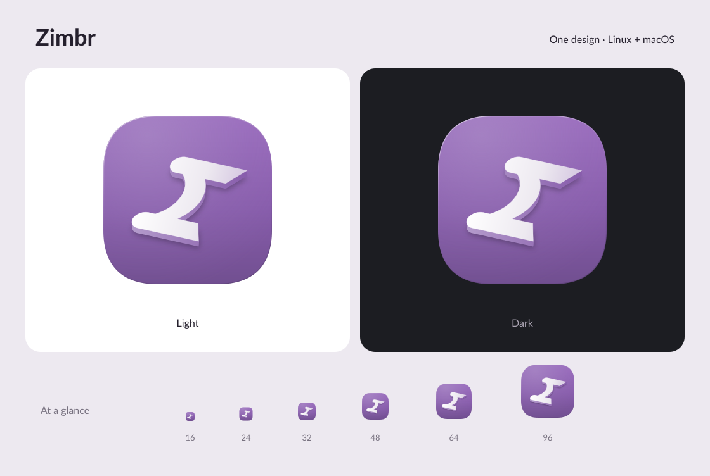

# Zimbr icon

One shared mark for the Wayland client and macOS relay: an abstract bridge viewed
at an angle, so its soft supports and broad curved span suggest a Z. The support
tips hint at speech tails. A shallow extrusion, shaded lavender side walls, a
fine highlighted contour, and a soft cast shadow give the bridge depth.

The tile runs vertically from light violet (`#9A6CBE`) through `#875CAB` to
deeper violet (`#714F90`). A broad lavender highlight (`#B39ACB`) lights the upper
left, and a fine inset rim gives the tile a gently rounded edge. The bridge face
shades from white through `#EDE9F0` to pale lavender (`#D5C7E1`), with lavender
sides and a deep violet shadow (`#21182B`). The dark preview uses charcoal
(`#1C1D22`). These artwork colors inspire the lighter lavender accents and
graphite surfaces in [`src/client/theme.zig`](../../src/client/theme.zig); the
icon retains its own shading palette.

The bridge path is defined once in the SVG and reused for the face, extrusion,
and shadow. Depth is 14 units on the 512-unit canvas; lighting and contours
remain vector artwork, with only the cast shadow using a blur filter.

## Background study

Reviewed official app artwork and guidance on September 25, 2026. The visual
observations below inform the background; they are not claims about how those
apps implement their icons.

| Reference | Observed treatment | Application to Zimbr |
| --- | --- | --- |
| [Bear's Mac icon examples](https://bear.app/faq/bear-app-icons/) | Quiet single-hue gradients behind a dimensional white symbol | Keep the violet field simple and let the bridge be the focal point |
| [Things' OS 26 icon](https://culturedcode.com/things/blog/2025/09/things-for-os-26/) | Lit blue edges and a darker inset give the container depth | Use a restrained highlight along the tile's top edge |
| [Raycast's desktop icon](https://www.raycast.com/press) | A pronounced beveled border, textured dark face, and illuminated inset | Borrow only the edge definition, at a much lower intensity |
| [Apple's app icon guidance](https://developer.apple.com/design/human-interface-guidelines/app-icons) | Recommends simple backgrounds and subtle light-to-dark vertical gradients | Give the tile consistent top lighting and a deeper lower edge |

These effects target the shared static SVG/ICNS artwork. A future native
[Icon Composer](https://developer.apple.com/documentation/Xcode/creating-your-app-icon-using-icon-composer)
version would use separate layers and let the system apply its lighting effects.



- **Editable master:** [`../linux/zimbr.svg`](../linux/zimbr.svg), installed by the Linux build and installer.
- **PNG:** [`zimbr-1024.png`](zimbr-1024.png), 1024 × 1024 with transparent corners.
- **macOS:** [`../macos/zimbr.icns`](../macos/zimbr.icns), 16–1024 px with standard and Retina representations.

Both platforms use identical artwork and padding. The Mac installer copies the
ICNS into the app's `Contents/Resources` and sets `CFBundleIconFile`, following
[Apple's bundle convention](https://developer.apple.com/documentation/bundleresources/information-property-list/cfbundleiconfile).

The relay's menu bar uses a separate monochrome derivative:
[`../macos/status.svg`](../macos/status.svg), exported as
[`../macos/statusTemplate.pdf`](../macos/statusTemplate.pdf). It retains the bridge
silhouette and removes the tile, extrusion, contour, and shadow. AppKit displays
the vector PDF at 18 points with `isTemplate` enabled; the system supplies light,
dark, and selected appearances. Warnings add a monochrome exclamation mark.
Keep this silhouette aligned with changes to the shared bridge mark.

After editing the SVG, regenerate the committed exports from the repository root:

```sh
python3 tools/render-icons.py
```

Exporting requires `rsvg-convert` from librsvg. Normal builds and installations
use the committed files and do not require an image renderer. The exporter also
regenerates the menu bar PDF from its SVG.
